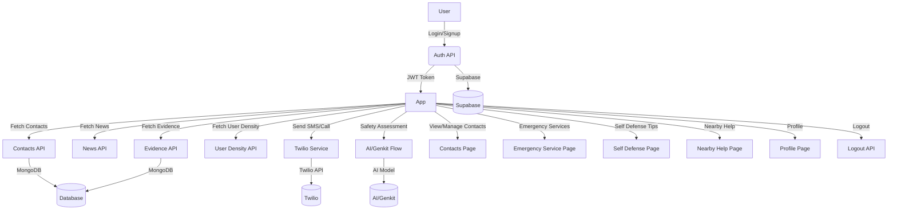

# Hersheild Project - Process Flow Diagram

**Legend:**
- Rectangles: Pages/Components
- Parallelograms: APIs/Services
- Circles: External Services/Databases

This diagram gives a high-level overview of the main flows in the Hersheild project, from user actions to backend services and external integrations.
